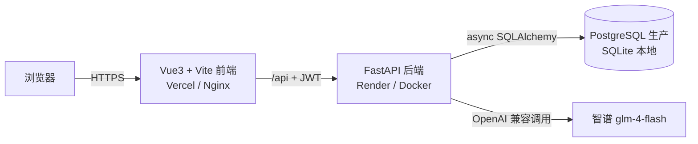

# CareerFlow AI · 智能求职助手

> 校招求职场景的全栈 AI 应用：**上传简历 / JD → LLM 分析匹配度 + 生成模拟面试问题**。
> 本项目刻意补齐「整套现代开发流程」：真实数据库 + 迁移、JWT 鉴权、前端构建、Docker、CI、可上线部署。

---

## 技术栈

| 层 | 选型 |
|----|------|
| 前端 | Vue 3 + Vite + TypeScript + Pinia + Vue Router + Element Plus |
| 后端 | FastAPI + SQLAlchemy 2.0（async）+ Pydantic v2 |
| 数据库 | PostgreSQL（docker-compose 路径） / SQLite（本地开发·测试·Render Free 兜底，零依赖可跑） |
| 迁移 | Alembic |
| 鉴权 | JWT（python-jose） + passlib（pbkdf2_sha256 哈希） |
| AI | OpenAI 兼容 LLM（默认智谱 `glm-4-flash` 免费，可切 DeepSeek） |
| 工程化 | Docker + docker-compose + GitHub Actions（pytest + ruff） |
| 部署 | Render（Docker 单服务，前后端同源托管） |

---

## 架构图



---

## 目录结构

```
Project-2/
├── backend/
│   ├── app/
│   │   ├── main.py          # 入口：生命周期 / CORS / 路由装配 / 同源静态托管
│   │   ├── config.py        # pydantic-settings（环境变量）
│   │   ├── database.py      # 异步引擎 / 会话 / Base
│   │   ├── models.py        # ORM 模型（跨库可移植）
│   │   ├── schemas.py       # Pydantic 请求/响应
│   │   ├── security.py      # 密码哈希 + JWT
│   │   ├── dependencies.py  # 当前用户解析
│   │   ├── llm.py           # LLM 封装（key 仅走环境变量）
│   │   ├── seed.py          # 自动 seed（应对临时文件系统丢库）
│   │   └── api/             # auth / resumes / jobs / analysis 路由
│   ├── migrations/          # Alembic 迁移
│   ├── tests/               # pytest（接口 + 鉴权 + 隔离）
│   ├── start.py             # Render 启动入口（读 $PORT）
│   ├── Dockerfile           # 仅 docker-compose / Postgres 路径用
│   ├── requirements.txt
│   └── pytest.ini
├── frontend/
│   ├── src/
│   │   ├── api/             # axios 封装（自动带 JWT）
│   │   ├── stores/          # Pinia 状态
│   │   ├── router/          # 路由 + 鉴权守卫
│   │   └── views/          # 登录 / 简历 / JD / AI 分析
│   ├── Dockerfile           # 多阶段：Vite 构建 → Nginx
│   ├── nginx.conf
│   └── package.json
├── docker-compose.yml       # 一条命令起全栈（前端+后端+Postgres）
├── Dockerfile               # Render 部署镜像（多阶段，前后端同源托管）
├── .dockerignore
├── render.yaml              # 可选：Render Blueprint 一键部署
└── .github/workflows/ci.yml # push 自动跑 pytest + ruff + 前端构建
```

---

## 本地启动（开发模式）

### 1. 后端

```bash
cd backend
python -m venv .venv && source .venv/bin/activate   # 或 uv venv
pip install -r requirements.txt

cp .env.example .env        # 填入 LLM_API_KEY（见下）
uvicorn app.main:app --reload --port 8000
```

- 默认用 SQLite（`sqlite+aiosqlite:///./careerflow.db`），**无需安装任何数据库即可跑**。
- 接口文档：http://localhost:8000/docs
- 启动时自动建表（`init_db`）；正式迁移请用 Alembic（见下）。

### 2. 配置 LLM（关键）

AI 分析依赖真实 LLM。**推荐智谱 `glm-4-flash`（免费）**：

1. 打开 https://open.bigmodel.cn 注册，在控制台创建 API Key。
2. 在 `.env` 中设置：

```
LLM_API_KEY=你的智谱key
LLM_BASE_URL=https://open.bigmodel.cn/api/paas/v4
LLM_MODEL=glm-4-flash
```

> DeepSeek 余额充足时也可切换：`LLM_BASE_URL=https://api.deepseek.com/v1`、`LLM_MODEL=deepseek-chat`。
> 未配置 `LLM_API_KEY` 时，分析接口会**优雅返回 503**，不影响其余功能（已被测试覆盖）。

### 3. 前端

```bash
cd frontend
npm install
npm run dev          # http://localhost:5173
```

> 开发服务器已配置 `/api` 代理到 `localhost:8000`，无跨域烦恼。

---

## 数据库迁移（Alembic）

开发期自动建表即可；生产/团队协作请用迁移：

```bash
cd backend
# 确保 .env 中 DATABASE_URL 指向目标库（SQLite 或 Postgres 均可）
alembic upgrade head          # 应用所有迁移
alembic revision --autogenerate -m "描述"   # 改了模型后生成新迁移
```

迁移对 SQLite 与 PostgreSQL 同构验证通过（CI 中即在真实 Postgres 服务容器上跑）。

---

## 测试

```bash
cd backend
pytest -q
```

覆盖：注册/登录/当前用户、错误路径（重复注册 409、密码错误 401、未鉴权 401）、
简历/JD 的 CRUD 与**用户数据隔离**、AI 分析接口的 LLM 降级（503）与正常解析落库。
默认跑在 SQLite；CI 中通过 `DATABASE_URL` 指向 Postgres 服务容器验证可移植性。

Lint：`ruff check app`

---

## Docker（一条命令起全栈）

```bash
# 在项目根目录
cp backend/.env.example backend/.env   # 填 LLM_API_KEY / SECRET_KEY
docker compose up --build
```

- 前端：http://localhost （Nginx 托管 + 反向代理 `/api` 到后端）
- 后端：http://localhost:8000
- 数据库：Postgres（容器化管理卷）

---

## CI（GitHub Actions）

每次 `push` / `PR` 自动执行：

- **backend job**：启动 Postgres 服务容器 → `ruff check app` → `alembic upgrade head` → `pytest`
- **frontend job**：`npm install` → `npm run build`（验证前端可构建）

全部绿灯才允许合并，保证「提交即可信」。

---

## 部署（Render · Docker 单服务，前后端同源托管）

> 借鉴自同构 RAG 项目的 Render 部署剧本，适配 CareerFlow：
> 多阶段 Docker 把前端 `dist` 拷进后端 `/app/static` 同源托管，免 CORS；
> `start.py` 直接读 `$PORT`；自动 seed 应对 Render 临时文件系统重启丢库。
> （RAG 项目的 `EMBEDDING_PROVIDER` 等 Chroma 专属配置不适用，本项目的 LLM 配置用 `LLM_*` 承载。）

### 方式 A：控制台手动（最直观）

1. 打开 https://dashboard.render.com → **New** → **Web Service** → 选本 GitHub 仓库。
2. 配置：
   - **Runtime**：`Docker`（自动识别仓库根 `Dockerfile`）
   - **Branch**：`main`
   - **Region**：离用户近（如 Singapore）
   - **Plan**：`Free`（15 分钟无流量会休眠，首次访问冷启动约 30–60s）
3. 左侧 **Environment** 添加变量（详见下表）。
4. **Create Web Service** → 首次构建约 4–8 分钟 → 访问 `https://<service-name>.onrender.com`。

### 方式 B：render.yaml 一键（可选）

Render 控制台 → **New** → **Blueprint** → 选仓库，自动按 `render.yaml` 创建（`SECRET_KEY` 自动生成、`LLM_API_KEY` 留空待你填）。

### 必须配置的环境变量

| KEY | VALUE | 说明 |
|---|---|---|
| `PORT` | （不用设，Render 自动注入） | `start.py` 读取 |
| `SECRET_KEY` | 随机长串（`python -c "import secrets;print(secrets.token_urlsafe(32))"`） | JWT 签名；render.yaml 可 `generateValue` |
| `LLM_API_KEY` | 你的 LLM Key | 推荐 dashscope（通义千问）规避智谱免费档 429 |
| `LLM_BASE_URL` | `https://dashscope.aliyuncs.com/compatible-mode/v1` | OpenAI 兼容；智谱则 `https://open.bigmodel.cn/api/paas/v4` |
| `LLM_MODEL` | `qwen-plus` | 智谱则 `glm-4-flash` |
| `AUTO_SEED` | `1` | 数据库为空时自动灌演示数据（演示账号 + 4 份示例简历 + 4 份示例 JD + 历史分析记录） |
| `DEMO_PASSWORD` | `CareerFlow2026` | 演示账号密码（可改） |
| `DATABASE_URL` | （不设，用默认 SQLite） | Free 实例用 SQLite；临时文件系统重启会清库，由 seed 兜底 |

> **安全红线**：真实 Key 只配在 Render 控制台 Environment，**绝不要写进仓库文件**（含 docs）。
> 本地 `.env` 已被 `.gitignore` 忽略；一旦在聊天/提交里暴露过，去对应平台「重新生成」新 Key。
> 演示账号 `demo@careerflow.app / CareerFlow2026` 为公开演示用，仅供作品集体验。

### 验证（部署后必做）

浏览器真实走一遍：① 根路径应看到前端 UI（非 Swagger）；② 用演示账号登录；
③「简历 / JD」页应各列出 4 条示例数据，可演示新建 / 编辑 / 删除；
④ 进入 AI 分析页，历史表格默认已有 5 条示例分析（含高/中/低匹配度），选简历+JD 点「开始分析」可生成实时结果（需 `LLM_API_KEY`）。
若根路径只看到 Swagger，说明 `dist` 未正确拷入 `/app/static`。

---

## 演示截图

> 以下步骤在本地 `docker compose up`（或分别起前后端）后，用浏览器走一遍即可截图补充到此处：
> 1. 注册 / 登录页
> 2. 简历列表 + 新建简历
> 3. JD 列表 + 新建 JD
> 4. AI 分析页：选择简历+JD → 匹配度评分 + 建议 + 模拟面试问题
>
> （截图文件较大，未随仓库提交；请本地运行后自行补充。）

---

## 已实现 vs 计划

- [x] FastAPI + SQLAlchemy 2.0 async + 跨库可移植模型
- [x] JWT 注册/登录/用户隔离
- [x] 简历 / JD 完整 CRUD
- [x] LLM 集成（Agent 式匹配分析 + 模拟面试问题，优雅降级）
- [x] Alembic 迁移（SQLite/Postgres 同构验证）
- [x] 前端 Vite 构建产物（Vue3+TS+Pinia+Element Plus，含路由/状态/鉴权守卫）
- [x] Docker + docker-compose 全栈
- [x] GitHub Actions CI（pytest + ruff + 前端构建）
- [x] pytest 覆盖核心接口与鉴权
- [x] Render 部署就绪（多阶段 Docker 同源托管 + start.py 读 $PORT + 自动 seed 应对临时文件系统）
- [x] 简历 / JD 文件上传解析（`.txt/.md/.pdf/.docx`；`pypdf`+`python-docx` 抽取文本，扩展名白名单 + 3MB 上限 + 空内容拒绝）
- [x] 投递管理看板（Application Tracker：状态机 `wishlist→applied→interview→offer→rejected` 闭环 + 看板 UI + 统计卡 + 5 条示例投递）
- [ ] 部署上线拿可点链接（需你提供 Render 账号，按上文部署步骤操作；我无 Render 凭证，无法代点控制台）
- [ ] 演示截图（部署后浏览器实测补充）
